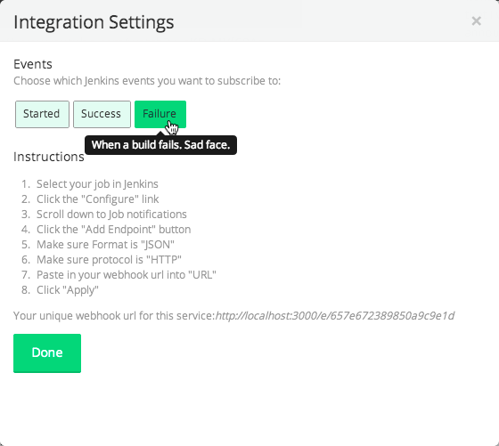

Gitter.im Services [](https://gitter.im/gitterHQ/services)
==================
The things that power your Gitter activity feed.

What services are available?
----------------------------
If its in the `lib` folder, we support it.

How to add your service
-----------------------
1. `git clone git@github.com:gitterHQ/services.git`
2. `cd services`
3. `npm install`
4. `npm test`

If everything passes, then you are ready!

### Basic structure
```
.
└── lib
    └── YOUR_SERVICE_NAME
        ├── index.js
        ├── icons
        │   ├── logo.png
        │   └── logo@2x.png
        ├── instructions.md
        ├── examples
        │   └── some_example_webhook.json
        └── test
            └── index.js
```

* `index.js`: This module has to export the following:
  * `apiVersion`: (_number_) the major version of this api.
  * `friendlyName`: (_string_) how you would like your service named to the user (e.g github's friendly name is GitHub).
  * `parse`: (_function_) the function to parse any incoming webhooks.
  * `options`: (_array_) EXPLAIN THIS
* `icons`: This directory contains all the png icons that can be used by this service. They must follow the following rules:
  * each icon must exist as both a 16x16 png and a 32x32 png (`name.png` and `name@2x.png` respectively).
  * there must be a logo icon (`logo.png` and `logo@2x.png`).
* `instructions.md`: The instructions the will be displayed when someone needs to set up your service to emit webhooks.
* `examples`: This directory contains examples to be used in your tests (and our sanity testting). Again, rules:
   * all examples must be in `json`.
   * all examples must be in the format `{ headers: {...}, body: {...} }`.
* `test`: directory of standard [mocha](http://visionmedia.github.io/mocha) tests. Cool people write tests. You _are_ cool, arn't you?


Example
-------
Lets say that you want to your service on Gitter to have a button like this:


Which opens up a configuration modal like this:



Which then outputs something like this:


Then your `index.js` needs to look like this:
```javascript
module.exports = {
  apiVersion: 0,
  friendlyName: 'Jenkins',
  parse: function(headers, body, hookConfig) {
    return {
      message: 'Jenkins [webhooks-handler](http://users-jenkins.server.com/job/webhooks-handler/6/) success',
      icon: 'smile',
      errorLevel: 'normal'
    };  
  },
  options: [
    { id: "started", name: "Started", description: "When a build is started.", selected: false },
    { id: "success", name: "Success", description: "When a build finishes successfully.", selected: false },
    { id: "failure", name: "Failure", description: "When a build fails. Sad face.", selected: true },
  ]
};
```
Your `instructions.md` should look like this:
```markdown
1. Select your job in Jenkins
2. Click the "Configure" link
3. Scroll down to Job notifications
4. Click the "Add Endpoint" button
5. Make sure Format is "JSON"
6. Make sure protocol is "HTTP"
7. Paste in your webhook url into "URL"
8. Click "Apply"
```
And your `icons` directory needs to contain these:


How to use
----------
`npm install gitter-services`
```javascript
var services = require('gitter-services');
console.log(services);

// {
//   jenkins: {...},
//   huboard: {...},
//   ...
// }
```
gitter-services will give you the following:

`console.log(services['some-service'])`

```javascript
{
  apiVersion: 0,
  friendlyName: 'Some Service',
  options: [{
    id: 'showBoringEvent',
    name: "Show Message For Boring Event",
    description: "When an issue or pull request is moved",
    selected: false
  }, ...],
  instructions: '1. read these instructions in markdown...',
  parse: function(hookHeaders, hookBody, config) {
    return {
      message: 'some markdown...',
      icon: 'someIcon',
      errorLevel: 'normal'
    };
  },
  icons: {
    logo: {
      legacy: '/path/to/icon/logo.png',
      retina: '/path/to/icon/logo@2x.png',
    },
    someIcon: {...}
  },
}
```
In practice, you would use it like this:
```javascript
var server = require('some-server');
var jenkins = require('gitter-services').jenkins;

server.get('/jenkins/instructions') = function(req, res) {
  res.render('some-instructions-template', {
    logo: jenkins.icons.logo.legacy,
    instructions: jenkins.instructions,
    configOptions: jenkins.options
  });
});

server.post('/jenkins/hookendpoint') = function(req, res) {
  var result = jenkins.parse(req.headers, req.body);
  server.pushToUser({
    icon: jenkins.icons[result.icon].legacy,
    content: result.message,
    style: result.errorLevel
  });
  res.send(200);
});

```

License
-------
MIT
