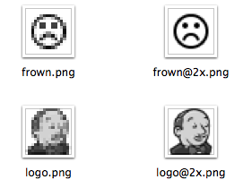

Gitter.im Services [](https://travis-ci.org/gitterHQ/services) [](https://gitter.im/gitterHQ/services)
==================
The things that power your [Gitter](https://gitter.im) activity feed.

Gitter.im uses this library to instruct a user on how to set up [webhooks](http://en.wikipedia.org/wiki/Webhook) for a particular external service (Jenkins, HuBoard etc). Then, when that service POSTs to gitter.im, this library is again used to parse the incoming data and get a human readable message. Gitter.im then displays the message in the user's activity feed.

What services are available?
----------------------------
If it is in the `lib` folder, we support it.

How to add your service
-----------------------
1. `git clone git@github.com:gitterHQ/services.git`
2. `cd services`
3. `npm install`
4. `npm test`

If everything passes, then you are ready!

### Basic structure
```
.
└── lib
    └── YOUR_SERVICE_NAME
        ├── index.js
        ├── icons
        │   ├── logo.png
        │   └── logo@2x.png
        ├── instructions.md
        ├── settings.json
        ├── examples
        │   └── some_example_webhook.json
        └── test
            └── index.js
```

* `index.js`: This module has to export the following:
  * `apiVersion`: (_number_) the major version of this api.
  * `name`: (_string_) how you would like your service named to the user (e.g github's name is `GitHub`).
  * `parse`: (_function_) the function called every time we receive an incoming webhook from your service. If it is an event that the user wants to see, then return a message object. If not, return something falsy.
    * has the signature `function(headers, body, settings)` where:
      * `headers`: (_object_) the headers of the webhook POST request e.g `{ "content-type": "application/json", ... }`.
      * `body`: (_object_) the body of the webhook POST request.
      * `settings`: (_object_) the settings that have been picked by the user e.g `{ events: {"someId": true, ... } }`. `events` will be a map of the the event `id`'s that a user has picked.
    * returns a message object with these properties:
      * `message`: (_string_) the message do be displayed (in markdown) e.g `"Some *Amazing* event has occured"`.
      * `icon`: (_string_) the name of an icon in the `icons` dir to display e.g `"logo"`.
      * `errorLevel`: (_string_) either `"normal"` or `"error"`. Error messages get styled red, and so the `icon` that you pick for this message must be red too ([#e74c3c](http://www.colorhexa.com/e74c3c)).
* `icons`: This directory contains all the png icons that can be used by this service. They must follow the following rules:
  * each icon must exist as both a 16x16 png and a 32x32 png (`name.png` and `name@2x.png` respectively).
  * there must be a logo icon (`logo.png` and `logo@2x.png`).
  * icons must be either black and white, or [#e74c3c](http://www.colorhexa.com/e74c3c) and white (for error messages).
* `instructions.md`: The instructions the will be displayed when someone needs to set up your service to emit webhooks.
* `settings.json`: This represents the settings available available to the user when creating an integration. At the moment, it's only list of events.
  Format is `{ "events": [event1, event2, ... ] }` where each event is an object that has these properties:
  * `id`: (_string_) a unique id that will be passed into the `parse` function if selected e.g `"high_five"`.
  * `name`: (_string_) a friendly name for your event e.g `"High Five"`.
  * `description`: (_string_) an explanation of the event e.g `"Single clap made by two people"`.
  * `selected`: (_boolean_) whether or not this event option is enabled by default.
* `examples`: This directory contains examples to be used in your tests (and our sanity testing). Again, rules:
   * all examples must be in `json`.
   * all examples must be in the format `{ headers: {...}, body: {...} }`.
* `test`: directory of standard [mocha](http://visionmedia.github.io/mocha) tests. Cool people write tests. You _are_ cool, arn't you?

### Settings
As shown above, settings available to the user are declared in a service's `settings.json`. These choices are then sent with every incoming webhook to that service's `parse` function. **It is up to the parse() function to decide if that hook is relevant to the users choices**.

For example, if you have the following settings.json:
```json
{
  "events": [
    {
      "id": "kitten_yawn",
      "name": "Kitten Yawn",
      "description": "Whenever a kitten yawns.",
      "selected": true
    },
    {
      "id": "kitten_purr",
      "name": "Kitten Purr",
      "description": "Whenever a kitten purrs.",
      "selected": true
    }
  ]
}
```

Then if the user only wants to be notified of `kitten_purr` events and **not** `kitten_yawn` events, then the `parse(headers, body, settings)` function will be called with a `settings` object like this:
```json
{
  "events": {
    "kitten_yawn": false,
    "kitten_purr": true
  }
}
```
The `parse` function then has to compare the `headers` and `body` with the `settings` to see what should be returned (if anything).

Example
-------
Lets say that you want to your service on Gitter to have a button like this:


Which opens up a configuration modal like this:


Which then outputs something like this:


Then your `index.js` needs to look like this:
```javascript
module.exports = {
  apiVersion: 1,
  name: 'Jenkins',
  parse: function(headers, body, settings) {
    return {
      message: 'Jenkins [webhooks-handler](http://users-jenkins.server.com/job/webhooks-handler/6/) success',
      icon: 'smile',
      errorLevel: 'normal'
    };  
  }
};
```
Your `settings.json` needs to look like this:
```json
{
  "events": [
    {
      "id": "started",
      "name": "Started",
      "description": "When a build is started.",
      "selected": false },
    {
      "id": "success",
      "name": "Success",
      "description":
      "When a build finishes successfully.",
      "selected": false
      },
    {
      "id": "failure",
      "name": "Failure",
      "description": "When a build fails. Sad face.",
      "selected": true
    }
  ]
}
```
Your `instructions.md` should look like this:
```markdown
1. Select your job in Jenkins
2. Click the "Configure" link
3. Scroll down to Job notifications
4. Click the "Add Endpoint" button
5. Make sure Format is "JSON"
6. Make sure protocol is "HTTP"
7. Paste in your webhook url into "URL"
8. Click "Apply"
```
And finally, your `icons` directory needs to contain these:



Community
---------
Are things going wrong? Are things going right? Do you have an awesome idea that you need a hand with?

Come and chat with everyone at [gitter.im/gitterHQ/services](https://gitter.im/gitterHQ/services).

Authors
-------

Started by [malditogeek](https://github.com/malditogeek), shuffled around by [trevorah](https://github.com/trevorah).

License
-------
MIT
